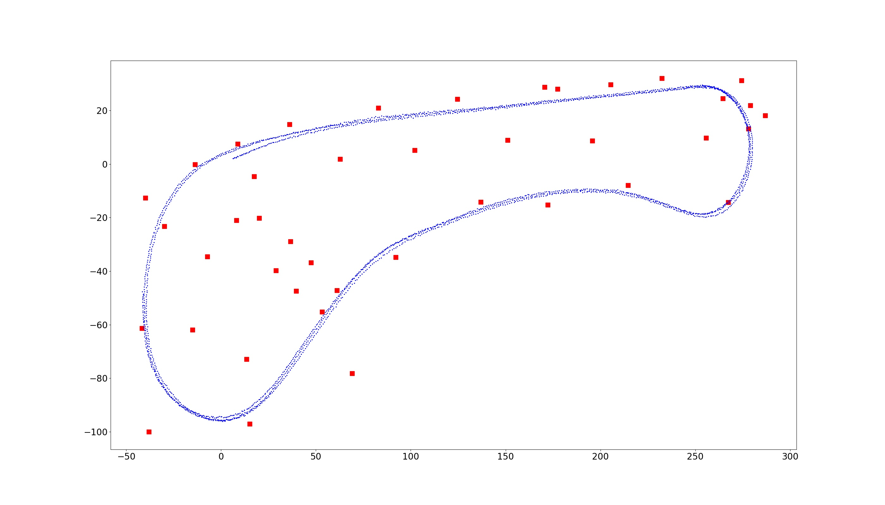

# Particle Filter Implementation
[](http://www.udacity.com/drive)



## Project Introduction
The objective of this project is to find a robot, which has been kidnapped and transported to a new location. The robot has a map of its location, a (noisy) GPS estimate of its initial location, and lots of (noisy) sensor and control data. The project will implement a 2 dimensional particle filter in C++ to detect the actual location of the Robot.
Particle filter belongs to the class of Bayesian Filter, which recursively estimates an objects state using incoming noisy measurements.

A [simulator](https://github.com/udacity/self-driving-car-sim/) is provided by Udacity which can be used to visualize the motion of the kidnapped car with all of its landmark measurements. The simulator provides the script for the noisy position data, vehicle controls, and noisy observations. The simulator also displays the best particle's sensed positions, along with the corresponding map ID associations. If the green laser sensors from the car nearly overlap the blue laser sensors from the particle, this means that the particle transition calculations are done correctly.

The project communicates with the Simulator using the [uWebSocketIO](https://github.com/uWebSockets/uWebSockets) object. The project calculates the best particles state and transmits the data to the Simulator.

[//]: # (Image References)

[image1]: ./images/particle_filter_process.png "particle filter implementation process"
[image2]: ./images/particle_count.png "particle count"
[image3]: ./images/motion_models.png "motion model"
[image4]: ./images/pseudo_code.png "pseudo code"
[image5]: ./images/homogenous_transformation.png "homogenous transformation"
[image6]: ./images/data_association.png "data association"
[image7]: ./images/final_weight.png "final weight calculation"
[image8]: ./images/pseudo_code.png "pseudocode"
[image9]: ./images/plot_at_time_0.jpg "particle filter snapshot"
[image10]: ./images/plot_at_time_1.jpg "particle filter snapshot"
[image11]: ./images/plot_at_time_2.jpg "particle filter snapshot"
[image12]: ./images/plot_at_time_3.jpg "particle filter snapshot"
[image13]: ./images/plot_at_time_4.jpg "particle filter snapshot"
[image14]: ./images/result.gif "result"

## Implementation of a Particle filter
The ultimate goal of Particle filter is to determine how well each particle represents the actual position of the car. The overall implementation of a Particle filter involves the following steps: <br>
![particle_filter_process][image1]

### Initialization
An empirical [study](https://knowledge.udacity.com/questions/29851), cited by one of the Udacity mentors, on the number of particles against the error in x and y shows that the error rates are at its minimum for a particle count of 100 or more.
![particle_count][image2]<br>
The results from the above study is used as the basis for the setting the particle count to **100**.
The associated positions `x`, `y`, and heading `theta` of each particle is initialized using GPS input. As with all sensor based operations, this step is impacted by noise. The noise components are randomly chosen from a normal distribution with a mean around the respective values of  `x`, `y`, and `theta` and a standard deviations of **0.3, 0.3 and 0.001** respectively.
```c++
// GPS measurement uncertainty [x [m], y [m], theta [rad]]
double sigma_pos [3] = {0.3, 0.3, 0.01};
```

### Prediction Step
In the prediction step, the vehicle location is calculated based on bicycle motion model. Using the control input variables (velocity and yaw-rate measurements), the vehicle's location is predicted by the following equations:<br>
![motion_model][image3]

Since the sensor measurements are noisy, the noise components are derived from a normal distribution with a mean around the predicted values of  `x`, `y`, and `theta` and a standard deviations of **0.3, 0.3 and 0.001** respectively.

The position of the car is described in map coordinates. The sensor measurements are described in vehicle coordinates, which has the x-axis in the direction of the car’s heading, the y-axis pointing orthogonal to the left of the car, and the z-axis pointing upwards.

### Update Step
The car knows each particle coordinates and observation coordinates. The idea is to use the particle coordinates and heading to transform the car's frame of reference to the map's frame of reference, associate the observations, then use the associated observations in the map domain to update the particle weight.

#### Transforming observations to map coordinates
Observations (measurements from the sensors) in the car coordinate system can be transformed into map coordinates (x<sub>m</sub>, y<sub>m</sub>) by passing car observation coordinates (x<sub>c</sub>, y<sub>c</sub>), map particle (x<sub>p</sub>, y<sub>p</sub>), and rotation angle through a homogenous transformation matrix. This **homogenous transformation matrix**, shown below, performs rotation and translation and the results are stored in the vector `observations_t`. <br>
![motion_model][image5]

#### Finding objects within the sensor range
Each sensor is configured with a **sensing range of 50m**. Each particle would be able to sense those landmarks within this range. These landmarks are copied to a vector `predicted_landmarks`.

#### Data association
The next step is to associate each transformed observation `observations_t` with one of landmark in the vector `predicted_landmarks`. The id of each observation is mapped to the id of the nearest landmark. The nearest landmark is calculated as the Euclidean distance between each particle and the given landmark. As shown in the picture below, an observation is associated with the landmark with the shortest Euclidean distance.<br>
![data_association][image6]

#### Final weight calculation
Next step is to calculate the particle's final weight. The particles final weight will be calculated as the product of each measurement's Multivariate-Gaussian probability density. The Multivariate-Gaussian probability density has two dimensions, x and y. The mean of the Multivariate-Gaussian is the measurement's associated landmark position and the Multivariate-Gaussian's standard deviation is described by the initial uncertainty in the x and y ranges. The Multivariate-Gaussian is evaluated at the point of the transformed measurement's position. The formula for the Multivariate-Gaussian can be seen below: <br>
![final_weight_calculation][image7]

### Resampling step
In the final step, the samples are replaced with a probability proportional to their weight. Resampling removes particles that are way off and increases the number of particles that show a good fit, thus increasing the overall average fit of the ensemble. Randomly selecting makes sure to not get stuck in a local optimum.

The above steps can be summarized with the following pseudocode :<br>
![pseudocode][image8]

---

## Results
The evaluation of the particle filter is done by using the weighted mean error function. The simulator calculates the error using the ground truth position of the car and the weights of the particles.
The simulator draws a **blue circle** on the best particle selected by the program. The **blue lines** are the sensor detections from the best particle to the landmarks in range. If the position of the "car" and the "blue circle" are overlapping, the particle filter implementation is successful. The simulator evaluates the results for a pre-defined time and displays the message **"Success. Your Particle filter passed"**, if the localization errors are within the thresholds.

A video capture of the evaluation process is shown below:
![final_result][image14]


## Visualization
To visually diagnose the particle filter implementation, the `main.cpp` was adapted to log the values of the all the Particle objects at the following instances within the program:
- After the call to `ParticleFilter::init(..)`
- After the call to `ParticleFilter::updateWeights (..)`
- After the call to `ParticleFilter::resample()`

NOTE: Since the Prediction step was a straight forward calculation, the data was not collected for debugging.<br>
After the completion of one round of execution, 2443 iterations of measurement were collected. For each measurement cycle, the data (x, y, theta, weights) of all particles (in total 100 * 2.443 = 244.300) were collected.

A [python script](https://github.com/thm2kor/Udacity-CarND-Kidnapped-Vehicle-P6/blob/main/visualizer/visualizer.py) was developed to plot the particles at different stages.<br>
![snapshot_at_time0][image9]
![snapshot_at_time1][image10]
![snapshot_at_time2][image11]
![snapshot_at_time3][image11]
![snapshot_at_time4][image12]

The above snapshot shows the position of the particles from the first 5 time steps. The scatter plot is coloured based on the `weight` parameter. The `best particle` with the maximum weight is shown with a blue coloured *star* marker. After the sampling step, it could be seen that the particles with very low weights (coloured blue) are replaced and only the particles with high weights remain.

---

**NOTE:** All screenshots linked in this README file are taken over from the Udacity CarND program - Lesson - Particle filter.

---
### Running the Code
The Simulator can be downloaded [here](https://github.com/udacity/self-driving-car-sim/releases).

This repository includes two files that can be used to set up and install [uWebSocketIO](https://github.com/uWebSockets/uWebSockets) for either Linux or Mac systems. For windows you can use either Docker, VMware, or even Windows 10 Bash on Ubuntu to install uWebSocketIO. Once the installation for uWebSocketIO is complete, the main program can be built and run by doing the following from the project top directory.

1. mkdir build
2. cd build
3. cmake ..
4. make
5. ./particle_filter

Alternatively the following shell scripts could be used to build and run the project:

1. ./clean.sh
2. ./build.sh
3. ./run.sh
